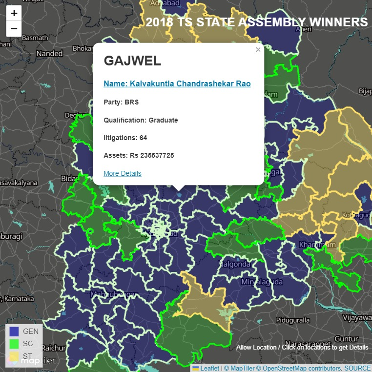

# Find my MLA
LIVE PORTAL - [CLICK](https://duni03.github.io/findmyMLA/)

> [!NOTE]
> Allow Location for easy navigation & Tap/Click on the map to get the details
## Data Source
[Telangana State Assembly Geo Data](https://data.telangana.gov.in/dataset/telangana-assembly-constituency-shape-files)
[2018 State Election Winner Data](https://www.myneta.info/telangana2018/index.php?action=show_winners&sort=default"])

## Tools

All used tools are open source and free.

| Tool | README |
| ------ | ------ |
| Leadlet | [https://leafletjs.com/] |
| Maptiler | [https://www.maptiler.com/] |
| OpenStreetMap | [https://www.openstreetmap.org/]|

### Task list
- [x] Basic Build
- [ ] Add Additonal States
- [ ] Add Contenders for upcoming elections (2023-24)
